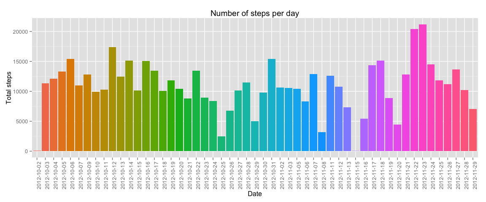
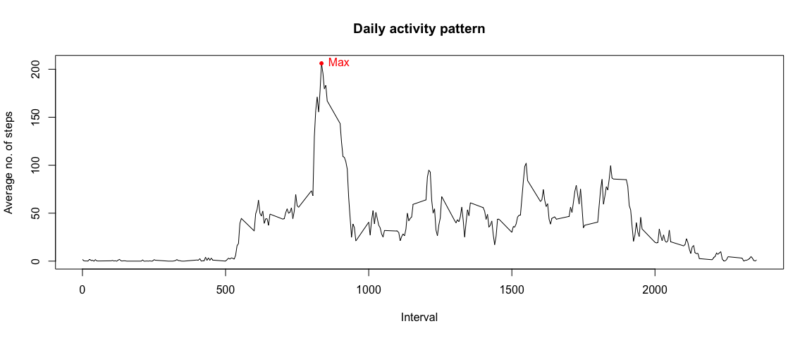
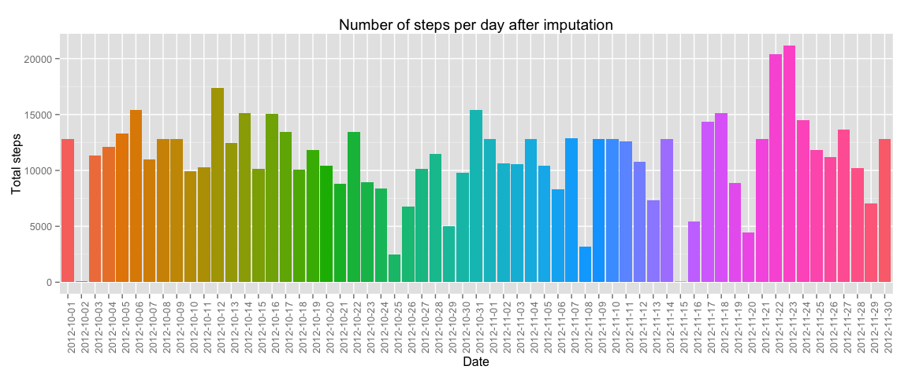
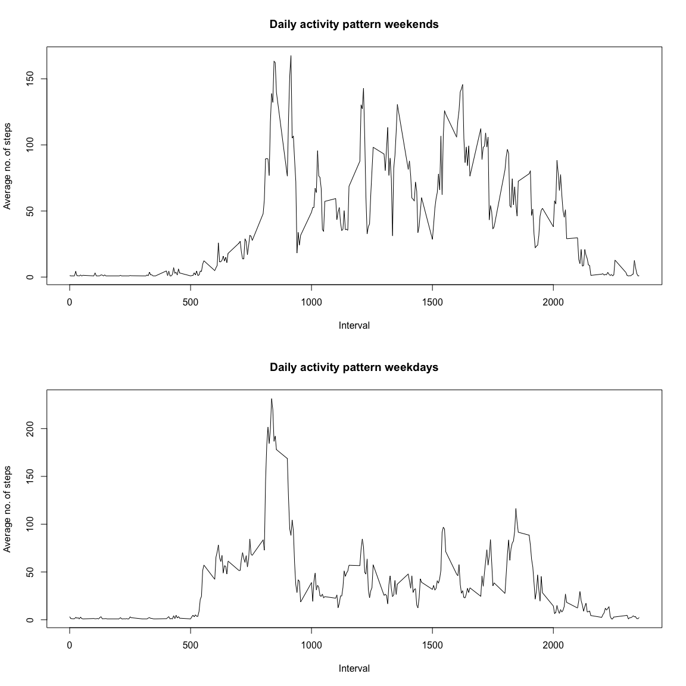

# Reproducible Research: Peer Assessment 1


## Loading and preprocessing the data


```r
# Unzip the original dataset and load it into a data.frame variable.
library(utils)
unzip("activity.zip", overwrite = FALSE)
```

```
## Warning in unzip("activity.zip", overwrite = FALSE): not overwriting file
## './activity.csv
```

```r
activity <- read.csv("activity.csv", colClasses=c("numeric", "Date", "numeric"))
summary(activity)
```

```
##      steps             date               interval     
##  Min.   :  0.00   Min.   :2012-10-01   Min.   :   0.0  
##  1st Qu.:  0.00   1st Qu.:2012-10-16   1st Qu.: 588.8  
##  Median :  0.00   Median :2012-10-31   Median :1177.5  
##  Mean   : 37.38   Mean   :2012-10-31   Mean   :1177.5  
##  3rd Qu.: 12.00   3rd Qu.:2012-11-15   3rd Qu.:1766.2  
##  Max.   :806.00   Max.   :2012-11-30   Max.   :2355.0  
##  NA's   :2304
```

## What is mean total number of steps taken per day?


```r
library(stats)
# Aggregate the data using the sum function in order to create the histogram.
total_steps_per_day <- aggregate(steps ~ date, activity, FUN = sum)
class(total_steps_per_day)
```

```
## [1] "data.frame"
```

```r
head(total_steps_per_day, n = 5)
```

```
##         date steps
## 1 2012-10-02   126
## 2 2012-10-03 11352
## 3 2012-10-04 12116
## 4 2012-10-05 13294
## 5 2012-10-06 15420
```

### Histogram of the total number of steps taken each day


```r
library(ggplot2)
# Make histogram using ggplot2.
ggplot(total_steps_per_day, aes(x = factor(date), y = steps, fill = factor(date))) +
  geom_histogram(stat = "identity") + theme(legend.position = "none",
    axis.text.x = element_text(angle = 90, hjust = 1)) + labs(x = "Date",
      y = "Total steps", title = "Number of steps per day")
```

 

### Mean and median of the total number of steps taken per day


```r
steps_mean <- mean(total_steps_per_day$steps, na.rm = TRUE)
steps_median <- median(total_steps_per_day$steps, na.rm = TRUE)
```

The **mean** of the total steps per day is 10766.19 and the **median** is 10765.00.

## What is the average daily activity pattern?


```r
# Aggregate data and find position of maximum value of steps.
average_steps_per_interval <- aggregate(steps ~ interval, activity, FUN = mean)
max_average_steps_slot <- which.max(average_steps_per_interval$steps)
```

### Time series plot of the 5-minute interval and the average number of steps taken, averaged across all days.


```r
plot(steps ~ interval, average_steps_per_interval, type = "l", main = "Daily activity pattern",
  xlab = "Interval", ylab = "Average no. of steps")
with(average_steps_per_interval, lines(x = interval[max_average_steps_slot], y = steps[max_average_steps_slot],
  type = "o", pch = 20, col = "red"))
with(average_steps_per_interval, text(x = interval[max_average_steps_slot], y= steps[max_average_steps_slot],
  labels = "Max", cex = 1, pos = 4, col = "red"))
```

 

### 5-minute interval containing the maximum number of steps.


```r
# Output the interval with the maximum average.
average_steps_per_interval[max_average_steps_slot, ]
```

```
##     interval    steps
## 104      835 206.1698
```

## Imputing missing values

### Number of missing values per variable.


```r
# Output a summary of NAs per column.
sapply(activity, function(x) sum(is.na(x)))
```

```
##    steps     date interval 
##     2304        0        0
```

### Imputing data using a strategy.

I will use the **average steps per interval** to impute the missing data, but will add some randomness too by calling the __runif__ function on each average. The use of a seed will allow making this strategy reproducible.


```r
# Function for calculating the number of steps based in the average.
imputableDataGenerator <- function(x) {
  set.seed(13)
  value <- round(runif(n = 1, min = x, max = x + 10))
  value
}

# This vector contains the value to imput for a given interval
# (e.g. interval == 0 --> steps == 9; interval == 20 --> steps == 7).
imputableData <- sapply(average_steps_per_interval[, 2], imputableDataGenerator)
average_steps_per_interval$imputableData <- imputableData

# Identify and keep the positions in the activity data.frame to fill.
positionsToFill <- which(is.na(x = activity$steps))

# Leave original DF untouched.
activity_copy <- activity

# Function that does the data imputation.
fillPositions <- function(positionsTofill) {
  for (i in positionsTofill) {
    theInt <- activity_copy[i, ]$interval
    whichInt <- which(average_steps_per_interval$interval == theInt)
    valueToInput <- average_steps_per_interval[whichInt, ]$imputableData
    activity_copy[i, ]$steps <<- valueToInput
  }
}

# Call function to fill missing data.
fillPositions(positionsToFill)
```

#### Comparing the resulting dataset to the previous one.


```r
# Original.
head(activity)
```

```
##   steps       date interval
## 1    NA 2012-10-01        0
## 2    NA 2012-10-01        5
## 3    NA 2012-10-01       10
## 4    NA 2012-10-01       15
## 5    NA 2012-10-01       20
## 6    NA 2012-10-01       25
```

```r
# With data imputed.
head(activity_copy)
```

```
##   steps       date interval
## 1     9 2012-10-01        0
## 2     7 2012-10-01        5
## 3     7 2012-10-01       10
## 4     7 2012-10-01       15
## 5     7 2012-10-01       20
## 6     9 2012-10-01       25
```

### After data imputation


```r
total_steps_per_day_imputed <- aggregate(steps ~ date, activity_copy, FUN = sum)
```

### Histogram of the total number of steps taken each day


```r
# Make histogram using ggplot2.
ggplot(total_steps_per_day_imputed, aes(x = factor(date), y = steps, fill = factor(date))) +
  geom_histogram(stat = "identity") + theme(legend.position = "none",
    axis.text.x = element_text(angle = 90, hjust = 1)) + labs(x = "Date",
      y = "Total steps", title = "Number of steps per day after imputation")
```

 

### Mean and median of the total number of steps taken per day


```r
steps_mean_imputed <- mean(total_steps_per_day_imputed$steps, na.rm = TRUE)
steps_median_imputed <- median(total_steps_per_day_imputed$steps, na.rm = TRUE)
```

The **mean** of the total steps per day is 11033.18 and the **median** is 11458.00.

The impact of imputing data causes a slight difference in the average and median. Since my imputation strategy added some randomness and increased in ten units the number of steps (exactly 10, see **imputableDataGenerator**) to each missing observation, both values are higher.

## Are there differences in activity patterns between weekdays and weekends?


```r
# Add day type column to imputed dataset.
activity_copy$daytype <- as.factor(ifelse(weekdays(activity_copy$date)
  %in% c("Saturday", "Sunday"), "Weekend", "Weekday")) 
```

### What is the average daily activity pattern, again?


```r
# Subset data for plotting.
weekend <- subset(activity_copy, subset = activity_copy$daytype == "Weekend")
average_steps_per_interval_weekend <- aggregate(steps ~ interval, weekend, FUN = mean)
weekday <- subset(activity_copy, subset = activity_copy$daytype == "Weekday")
average_steps_per_interval_weekday <- aggregate(steps ~ interval, weekday, FUN = mean)
```

### Time series plot of the 5-minute interval and the average number of steps taken, per day type.


```r
# Create a 2-row panel and add plots
par(mfrow = c(2, 1))
plot(steps ~ interval, average_steps_per_interval_weekend, type = "l", main = "Daily activity pattern weekends",
  xlab = "Interval", ylab = "Average no. of steps")
plot(steps ~ interval, average_steps_per_interval_weekday, type = "l", main = "Daily activity pattern weekdays",
  xlab = "Interval", ylab = "Average no. of steps")
```

 

In the plots there it can be noticed that people tends to walk **more** on weekends. The average is noticeably higher on saturdays and sundays.

Let's take summaries to confirm the previous affirmation:


```r
# Summarize data to help interpretation of plot.
summary(average_steps_per_interval_weekend)
```

```
##     interval          steps        
##  Min.   :   0.0   Min.   :  0.875  
##  1st Qu.: 588.8   1st Qu.:  2.172  
##  Median :1177.5   Median : 33.188  
##  Mean   :1177.5   Mean   : 43.250  
##  3rd Qu.:1766.2   3rd Qu.: 75.594  
##  Max.   :2355.0   Max.   :167.500
```

```r
summary(average_steps_per_interval_weekday)
```

```
##     interval          steps         
##  Min.   :   0.0   Min.   :  0.9333  
##  1st Qu.: 588.8   1st Qu.:  3.2222  
##  Median :1177.5   Median : 26.7444  
##  Mean   :1177.5   Mean   : 36.5531  
##  3rd Qu.:1766.2   3rd Qu.: 51.7389  
##  Max.   :2355.0   Max.   :231.2889
```

- **Mean and median** for steps during weekends are: 43.25 and 33.1875.
- **Mean and median** for steps during weekdays are: 36.5530864 and 26.7444444.
